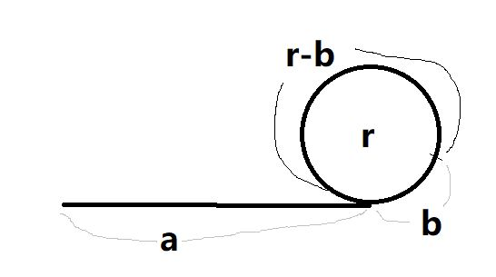

## 单链表带环问题

* 关键模型
  - 快慢指针的追击模型，如 slower=1, faster=2
* 相关性质
  - 两指针相遇时，faster 走过的路程为 slower 的2倍
* 量化参数
  - 某个时刻：t 时间后（也就是节点数目），两指针相遇，此时 slower(s) 和 faster(f) 都在环内，相隔k点，环内共有r点
  - 相遇点：环外长度 a，slower 在环内走了 b，环长 r => a+nr+b=2(a+b)，n>=1

### 是否有环

快慢指针相遇，即判断有环。

### 求环长度

* 假定出发点，是 faster 和 slower 的第一次相遇。
* 第二次相遇，在环内 X 点；再次作为出发点，且开始计数。
* 第三次相遇，在环内 Y 点，此时 faster 比 slower 多走一个 环长 R。

### 求环入口

* 化简相遇点公式
  - a=nr-b, 即: a=(n-1)r+r-b
  - 意味着 slower 从 链表头出发，faster 从第二次相遇的点出发，它们将在入口点相遇！

### 求链长度

有了环长度，有了环入口，链长度 = a+r